# Awesome-Centralized-Cloud-User-Notifications

# Awesome-Centralized-Cloud-User-Notifications 📬 🔔



  





  
  
  
  
  
  



---

## 🌟 Top Centralized Cloud User Notifications Ecosystem

**Curated List of Commercial Notification Platforms & Open-Source Infrastructure Tools**  
*Focused on Multi-Channel Delivery, Incident Alerting, Status Pages, On-Call Management & Self-Hosted Notification Pipelines*  

**Last updated: October 2026** 📅

---

### 📌 Overview & SEO Summary
Welcome to the ultimate curated directory of **centralized cloud user notification platforms**, **open-source incident response tools**, and **multi-channel notification infrastructure**. Whether you are looking for enterprise-grade commercial solutions (such as *PagerDuty*, *Opsgenie*, and *Courier*), or self-hostable open-source alternatives (like *Novu*, *Notifo*, and *Skylogs*), this list covers category leaders, alert routing engines, and privacy-respecting notification systems.

---

## 📑 Table of Contents
- [🏢 SaaS & Commercial Platforms](#-saas--commercial-platforms)
- [🔓 Open-Source GitHub Projects](#-open-source-github-projects)
- [🛠️ How to Contribute](#%EF%B8%8F-how-to-contribute)
- [📊 Star History](#-star-history)
- [🤝 Support & Sponsorship](#-support--sponsorship)
- [⚠️ Disclaimer](#%EF%B8%8F-disclaimer)

---

## 🏢 SaaS / Commercial Platforms

The centralized notification and incident management market is dominated by a mix of full-stack incident platforms and specialized notification infrastructure services. Pricing models vary: PagerDuty charges per user with tiered plans (Professional ~$21/user/month, Business ~$41/user/month), Opsgenie (Atlassian) starts around $9.50/user/month, Statuspage charges per subscriber tier with a free plan for 25 subscribers, and Courier offers a free tier with 10,000 notifications/month before usage-based pricing.

| SaaS / Commercial Platform | Company / Owner | Valuation / Market Cap | Standard Edition Starting Price | Free Tier / Free Trial Limits | Description |
| :--- | :--- | :--- | :--- | :--- | :--- |
| **[AWS User Notifications](https://aws.amazon.com/notifications/)** ☁️ | Amazon | ~$2.0 Trillion | **Free service** | **Free forever** | **AWS-native centralized notifications** — Configure delivery channels (email, chat, console) for AWS service events. Aggregates notifications from multiple AWS services into a single view. |
| **[PagerDuty](https://www.pagerduty.com/)** 🚨 | PagerDuty Inc. | ~$2 Billion (Public) | Professional: ~$21/user/month (annual) | **14-day free trial**; no permanent free tier | **Incident response platform** — Alert routing, on-call schedules, escalation policies. 700+ integrations with monitoring tools. |
| **[Opsgenie (Atlassian)](https://www.atlassian.com/software/opsgenie)** 🔵 | Atlassian | ~$50 Billion | Standard: ~$9.50/user/month | **Free tier for up to 5 users** | **Incident management and alerting** — On-call scheduling, escalations, and multi-channel notifications. Integrates with Jira Service Management. |
| **[Splunk On-Call (VictorOps)](https://www.splunk.com/en_us/products/on-call.html)** 🟠 | Cisco (Splunk) | ~$200 Billion (Cisco) | Custom enterprise pricing | **14-day free trial** | **Incident response for DevOps** — On-call management, alert routing, and collaboration. Timeline-based incident visibility. |
| **[Incident.io](https://incident.io/)** ⚡ | Incident.io | Private | Custom per-user pricing | **Free trial available** | **Slack-native incident management** — Declare incidents, assemble responders, and automate workflows directly in Slack. |
| **[Squadcast](https://www.squadcast.com/)** 🎯 | Squadcast | Private | Custom per-user pricing | **Free tier available** | **Incident response and on-call** — Alert routing, escalation policies, and SLO tracking. Focus on reliability engineering. |
| **[Better Uptime](https://betterstack.com/better-uptime)** 🟢 | Better Stack | Private | Free: 10 monitors; Paid from $18/month | **Free tier: 10 monitors, 3-minute checks** | **Uptime monitoring with status pages** — Incident management, on-call scheduling, and public status pages. |
| **[Statuspage (Atlassian)](https://www.atlassian.com/software/statuspage)** 📄 | Atlassian | ~$50 Billion | Free: 25 subscribers; Paid from $29/month | **Free tier: 25 subscribers, 1 status page** | **Status page and incident communication** — Communicate service status to users. Integrates with monitoring tools for automated updates. |
| **[Twilio SendGrid](https://sendgrid.com/)** 📧 | Twilio | ~$30 Billion | Free: 100 emails/day; Paid from $19.95/month | **Free tier: 100 emails/day forever** | **Email delivery infrastructure** — Transactional and marketing email at scale. The delivery engine behind many notification systems. |
| **[Courier](https://www.courier.com/)** 📬 | Courier | Private | Free: 10,000 notifications/month; Paid from $99/month | **Free tier: 10,000 notifications/month** | **Multi-channel notification API** — Single API for email, SMS, push, chat, and in-app. Template management and user preference handling. |

---

## 🔓 Open-Source GitHub Projects

*Sorted by GitHub_Stars_Count (Descending)* 🌟

- **[Novu](https://github.com/novuhq/novu)**   
  **The open-source notification infrastructure for developers**, MIT licensed. **36,814 stars, 4,003 forks** . **Single API for all messaging providers** (In-App, Email, SMS, Push, Chat). **Embeddable notification center** with real-time updates. GitOps workflows, local dev studio, and type safety. Supports Sendgrid, Mailgun, SES, Postmark, Twilio, SNS, Vonage, and 40+ other providers. Docker self-hosting available. **The most popular open-source notification infrastructure project** . 🚀

- **[Apprise](https://github.com/caronc/apprise)**   
  **Push notifications that work with just about every platform**, BSD-2-Clause licensed. **14,186+ stars**. **90+ notification services supported** — Discord, Slack, Telegram, Email, SMS, Pushover, Gotify, Ntfy, PagerDuty, Opsgenie, and more. Simple unified syntax: `apprise://` URLs. **The Swiss army knife of notification delivery** . 🔔

- **[Skylogs](https://github.com/skylogsio/skylogs)**   
  **Open-source incident response that survives the incident**, MIT licensed. **Truly open source** — no feature-gated core. **Multi-zone federation** and **Raft-based HA clustering** ensure the incident platform stays up during incidents . Consolidates alerts from Prometheus, Grafana, Zabbix, Datadog, and more. On-call schedules, escalation chains, and multi-channel notifications (phone, SMS, email, Slack, Teams, Telegram). **The most resilient self-hosted incident platform** . 🛡️

- **[Notifo](https://github.com/notifo-io/notifo)**   
  **Multi-channel notification service for collaboration tools, e-commerce, and news**, open-source. **Topic-based subscription model** — users subscribe to paths like `clothes/shoes/nike` . **Confirmation preference** (None/Explicit/Seen) reduces notification spam. **Channels**: Email (SMTP, SES, Mailjet), SMS (Twilio, MessageBird), Mobile Push (Firebase), Messaging (Telegram, Discord, WhatsApp), Web (SignalR/WebSockets), Web Push (VAPID), Webhook. REST API with OpenAPI docs. Docker Compose deployment. 📬

- **[Dittofeed](https://github.com/dittofeed/dittofeed)**   
  **Open-source customer engagement platform**, MIT licensed. **Omni-channel messaging** — email, mobile push, SMS, WhatsApp, Slack . **Journey Builder** for automated user journeys. **Segment Builder** with multiple operators. **Template Editor** (HTML/MJML or low-code). **Developer-centric**: Git-based workflows, testing SDK for CI, self-hostable to protect PII. Docker and Render deployment options. 🎯

- **[Kener](https://github.com/rajnandan1/kener)**   
  **Stunning self-hosted status pages**, MIT licensed. Built with SvelteKit and NodeJS . **Monitoring and tracking** — HTTP endpoint polling or push data via REST API. Cron-based scheduling (minimum per minute). **Incident management** with communication APIs. **Customization** — badges, custom domains, iframe/widget embedding, light/dark theme, i18n. Docker deployment with pre-built image. **Beautifully crafted status pages without the enterprise overhead** . 📊

- **[ntfy](https://github.com/binwiederhier/ntfy)**   
  **Send push notifications to your phone or desktop using PUT/POST**, open-source. **Simple HTTP-based notification** — no complex setup . **Self-hostable** or use ntfy.sh. Priority levels, attachments, action buttons, and topic-based subscriptions. **Desktop clients** for Windows, Linux, and macOS. **The simplest way to get notifications from scripts and services** . 📡

- **[notifkit](https://www.npmjs.com/package/notifkit)**   
  **Self-hosted notification infrastructure**, MIT licensed. **One call delivers to email, SMS, push, and webhook** — routed by preference, quiet hours, and consent . **Reliability**: Redis Streams, 24h idempotency, backoff retries, DLQ, provider circuit breakers. **Preferences**: per-user channel opt-outs, quiet hours, contact-level overrides. **Workflows**: multi-step sequences with wait and waitForEvent. **MCP server** for terminal-based agent control. Prometheus metrics and queryable delivery log. Node 22+, PostgreSQL, Redis. 🛠️

- **[ups](https://github.com/codenamev/ups)**   
  **Modern self-hostable status pages built with Rails 8 + SQLite**, AGPL-3.0 licensed. **No Redis, no Postgres, no external dependencies** — deploy anywhere Docker runs . **Status Pages** with components and real-time states. **Incident Management** with full timeline history. **Subscriber Notifications** via email. **Synthetic Monitoring** (HTTP/HTTPS/TCP). **REST API** with token auth. **MCP Server** for AI agent integration. Docker quick start in 5 minutes. 🚀

- **[Uptime Kuma](https://github.com/louislam/uptime-kuma)**   
  **Self-hosted website monitoring tool like Uptime Robot**, MIT licensed. **Docker/Nodejs** deployment . Monitoring for HTTP(s), TCP, Ping, DNS, and more. **Notification integrations** with 90+ services via Apprise. Status pages and multi-language support. **The most popular open-source uptime monitor** . 📈

- **[Gatus](https://github.com/TwiN/gatus)**   
  **Automated service health dashboard**, Apache-2.0 licensed. **Docker/K8S** deployment . **Condition-based health checks** — define success criteria using status codes, response time, body content, and certificate expiry. **Alerting** via Slack, PagerDuty, Discord, Telegram, and more. **Status page** generation included. ⚙️

- **[Skylogs (Sentinel)](https://github.com/skylogsio/skylogs)**   
  **Multi-zone federation layer for incident response**, MIT licensed. **Sentinel** is a lightweight Go service that heartbeats between zones . **Alert data stays local to each zone** — the zone closest to the failing system keeps paging even when cut off. **Organizational data synchronized** — users, teams, schedules, and policies are the same everywhere. **Survives datacenter disasters** — the incident platform remains operational when you need it most. 🌍

- **[StatPing.ng](https://github.com/statping-ng/statping-ng)**   
  **Easy-to-use status page for websites and applications**, GPL-3.0 licensed. **Docker/Go** deployment . Automatically fetches application status and renders a beautiful status page. **Notification support** for multiple channels. **Database options**: SQLite, MySQL, PostgreSQL. 🎯

---

## 🛠️ How to Contribute

Contributions are welcome! Follow these steps to submit new centralized notification platforms or open-source alerting software:

1. 🍴 **Fork** the repository.
2. 📝 **Add/edit** entries in `README.md` maintaining table/list structure and formatting.
3. 🔗 Include project title, official website/GitHub link, exact Stars_Count, license, and brief description.
4. 🚀 Submit a **Pull Request** with a descriptive summary of your changes.

---

## 📊 Star History



---

## 🤝 Support & Sponsorship

If you find this centralized cloud user notifications repository useful, please consider supporting the project:

- ⭐ **Star** this repository to increase visibility!
- 🔀 **Fork** and share with fellow developers, SREs, and DevOps engineers.
- ☕ **Sponsor & Buy Me a Coffee**: Support ongoing open-source curation via the [GitHub Sponsor Dashboard](https://github.com/sponsors/ishandutta2007).

---

## ⚠️ Disclaimer

- This is a **community-curated** list — not exhaustive and not an endorsement. ℹ️
- Notification platforms handle sensitive alert data and user contact information. **Review data residency, encryption, and consent management** before committing. Commercial platforms like PagerDuty and Opsgenie charge per-user with tiered feature gating.
- **Novu**, **Apprise**, and **Skylogs** provide self-hosted ownership and transparency, but enterprise-grade SLA guarantees, 24/7 support, and managed infrastructure remain primarily commercial offerings. **Skylogs** is specifically architected to survive the very incidents it's meant to alert on — multi-zone federation ensures the incident platform itself doesn't become the incident . 🔔

---



  <b>Made with ❤️ for SREs, DevOps engineers, and open-source notification infrastructure advocates.</b>

